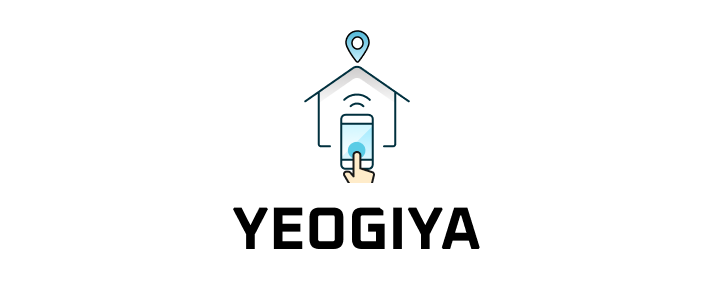

 
 
<h2>프로젝트 소개</h2>
‘여기야’는 프로포즈, 스몰웨딩, 돌잔치 등의 특별한 순간을 위한 공간을 제공하고, 
미팅룸, 스튜디오, 소극장 등의 문화생활을 할 수 있는 다양한 공간을 제공하는 서비스입니다.
 
 
예약이 필요한 사람들은 게스트로서 카테고리 선택과 검색을 통해 원하는 장소를 편리하게 예약할 수 있고, 
장소 홍보가 필요한 사람들은 호스트로서 다양한 공간을 업로드하여 손쉽게 게스트가 원하는 이벤트 장소를 제공할 수 있습니다.
 
 

 
위 이미지를 클릭하면 여기야로 이동합니다.

<h2>팀원 소개</h2>
 
<table>
  <tbody>
    <tr>
      <td align="center" >
        👸 <a href="https://github.com/jinahp"><b>박진아</b></a> 
        팀장 
      </td>
      <td align="center">
        🍔 <a href="https://github.com/kimsuns"><b>김선영</b></a> 
        햄버거 킬러 
      </td>
      <td align="center">
       👶 <a href="https://github.com/soyxxn"><b>박소연</b></a> 
        뿡빵 소유자 
      </td>
      <td align="center">
        🎅 <a href="https://github.com/mocking-tiger"><b>박준용</b></a> 
        산타 
      </td>
      <td align="center">
        🐸 <a href="https://github.com/ahrrrl"><b>조현진</b></a> 
        행동대장 
      </td>
  </tbody>
</table>
 
<h2>사용 기술</h2>

 
 

<h2>역할 분담</h2>
<h3>🌊 박진아 </h3>
예약 현황 페이지 
로딩, 에러 페이지 
공통 컴포넌트: 캘린더, 버튼 
<h3>🌊 김선영 </h3>
로그인 페이지 
회원가입 페이지 
내 정보 페이지 
공통 컴포넌트: 드롭다운 
<h3>🌊 박소연 </h3>
메인 페이지 
예약 내역 페이지 
공통 컴포넌트: 헤더, 푸터, 페이지네이션 
<h3>🌊 박준용 </h3>
공간 상세 페이지 
공통 컴포넌트: 토스트 
<h3>🌊 조현진 </h3>
내 공간 관리 페이지 
내 공간 등록 페이지 
내 공간 수정 페이지 
공통 컴포넌트: 모달 
 

